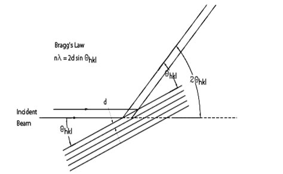
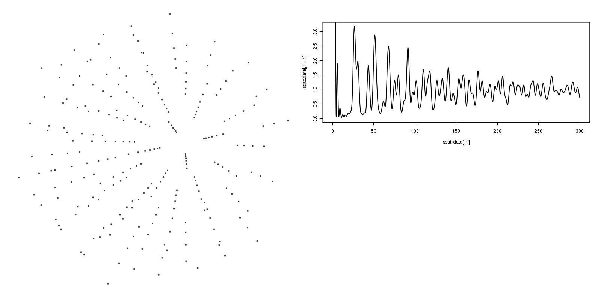
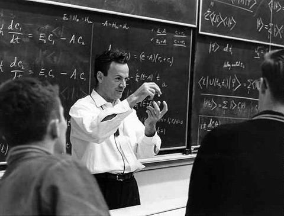
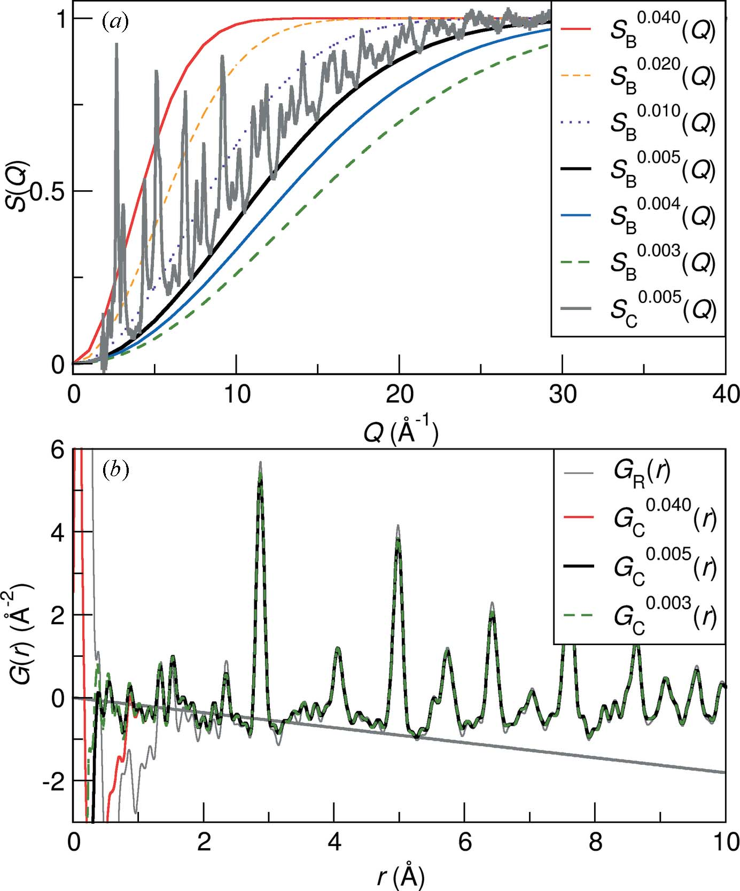
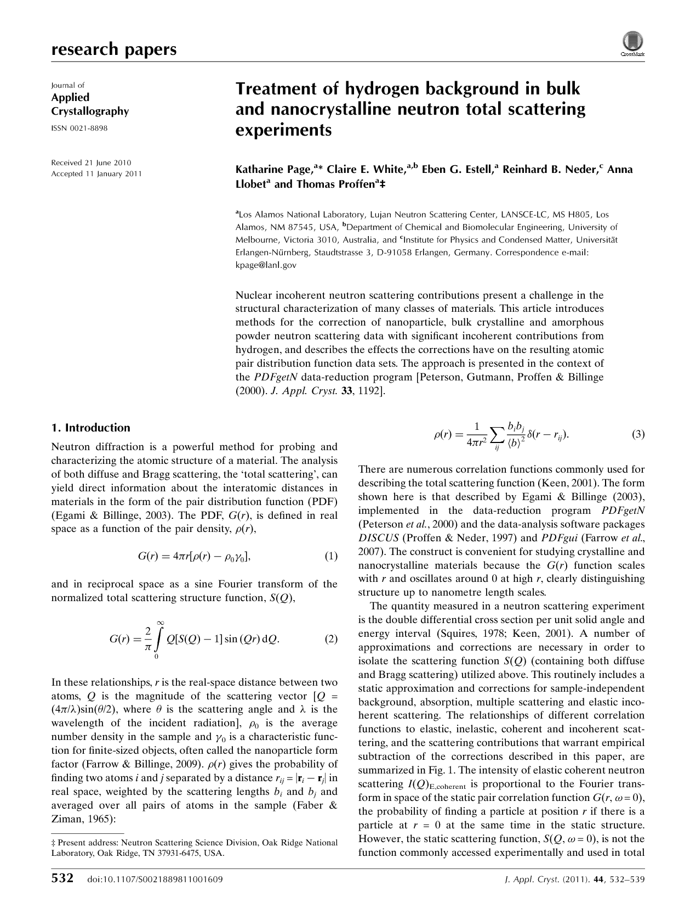
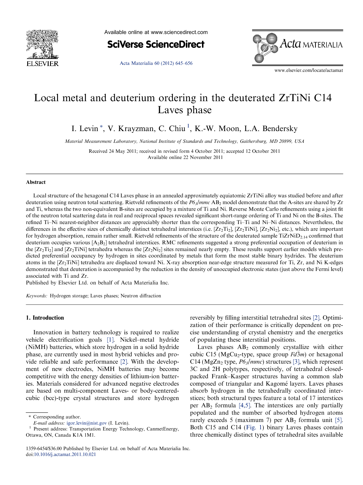
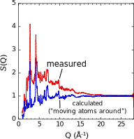
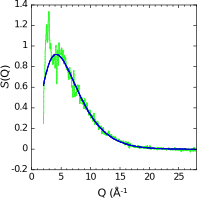
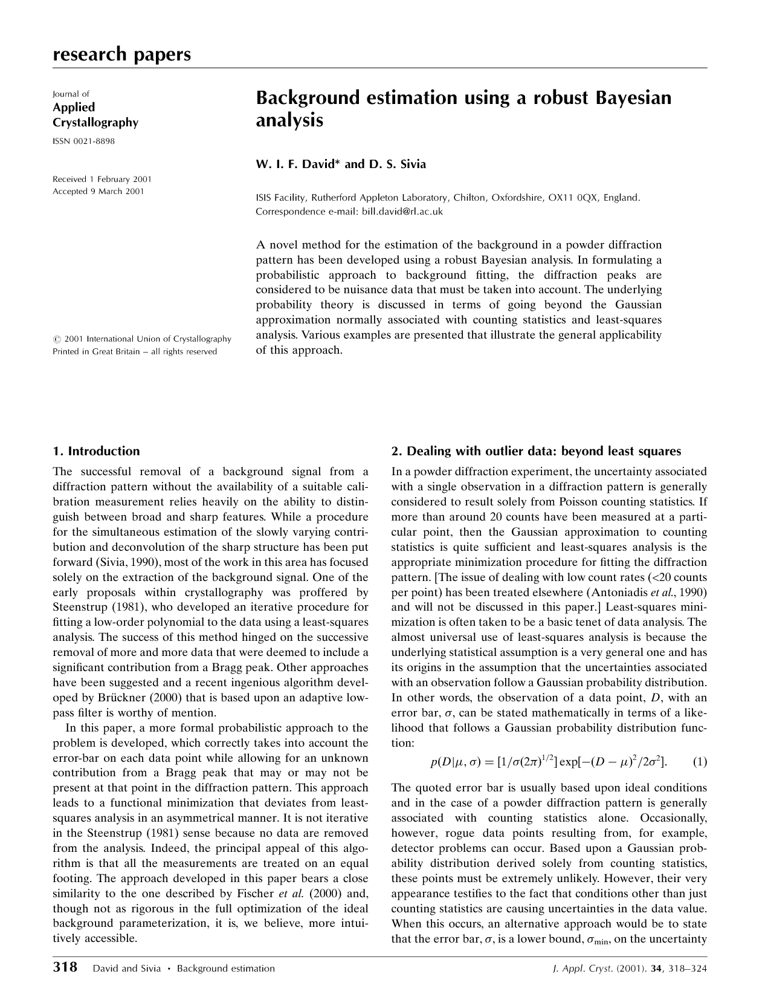
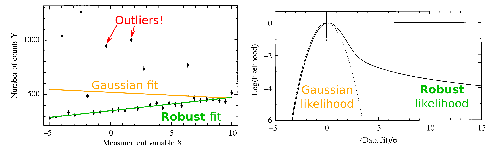

---

# **bestinbg**: progress report
## (**B**ayesian **Est**imation of **I**ncoherent **N**eutron Scattering **B**ack**g**round)

Charles Hogg  
October 1, 2012

---

# The Problem

--- leftimg #whyscatter

### Why scatter neutrons?

  Coherent scattering *tells us __how the atoms are arranged__*

  - \(G(r)\): **interatomic distances**
  - \(S(Q)\): **measured scattering**
  - **_Key_**: \(G(r) \overset{Fourier}{\leftrightarrow} S(Q)\)

---

### An apt metaphor...

Coherent scattering 

Incoherent H-scattering 

--- leftimg

### Well, actually...

Not all regions affected equally!

  - Fourier transforms: 
    wide \(Q\) \(\leftrightarrow\) small \(r\)
  - Really only aiming for 
    **local correlations**

  <small>(Figure from Page et al. (2011))</small>

---

# Existing Approaches
## (incoherent H signal)

--- fullimg

### Los Alamos approach (Page et al.)

--- fullimg

### NIST approach (Levin et al.)

--- leftimg

### NIST approach (Levin et al.)

**Observe**: can't reproduce experimental signal just by  "moving atoms around"!

  - "Best guess" from *Rietveld refinement*
      - Industry standard
      - **average** positions
  - Difference due to *incoherent scattering*, of course

--- leftimg

### NIST approach (Levin et al.)

Fit *difference* using **custom curve**

**Assumptions**

  - Only *broad* features
  - *Single* peak, low-\(Q\)
  - *No hi-\(Q\) oscillations*

  \(f(Q) = \color{red}{\alpha} \exp\left[-\color{red}{\beta} Q\right] Q^\color{red}{\gamma} + \frac{\color{red}{\delta}}{(Q - \color{red}{\epsilon})^2 + \color{red}{\zeta}^2} \)

---

# Existing Approaches
## (backgrounds in general)

--- fullimg

### David and Sivia (JAC 2000)

--- fullimg

### "Digression": how to handle outliers

  - **Gaussian fit**: <small>\(p(D | \mu, \sigma) \propto \exp\left(-\frac{(D-\mu)^2}{2\sigma^2}\right) \)</small>
    - Assume some points have higher \(\sigma\)!
    - Jeffreys prior with pessimistic cutoff
  - **Robust fit**: <small>\(p(D | \mu, \color{red}{\sigma_\text{min}, \sigma_\text{max}})
    = \int\limits_0^\infty p(D | \mu, \sigma) p(\sigma | \color{red}{\sigma_\text{min}, \sigma_\text{max}}) d\sigma \)</small>

---

### Paradigm: treat signal as noise

(Sounds odd, but it *is* the **background** we're after...)

---

# My approach

---

# Open questions

---

### "Horizontal" uncertainties?

---

### ***The Holy Grail***:  Full Bayesian probability model

  - No more "signal is noise": signal is *physics*!
  - Background priors: just the same
  - *Atomic position* priors: insert physics here!
    - Boltzmann probability (energy-based):  a very natural fit
  - Obviously the "right" way to go...
    - (...but computational expense probably *immense*)

---

### fun with d3!

<svg id="testing" width=400 height=400 xmlns="http://www.w3.org/2000/svg"></svg>

